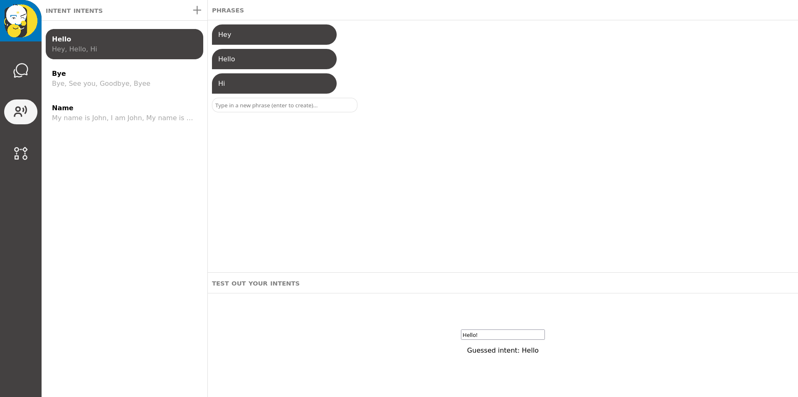
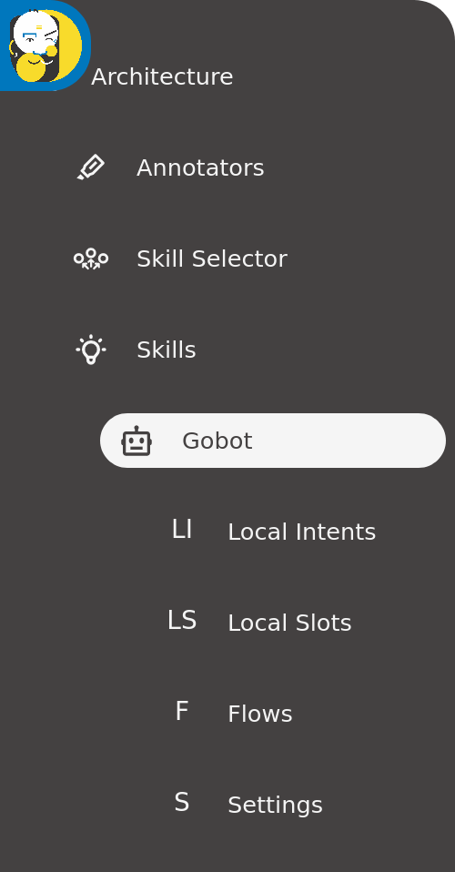
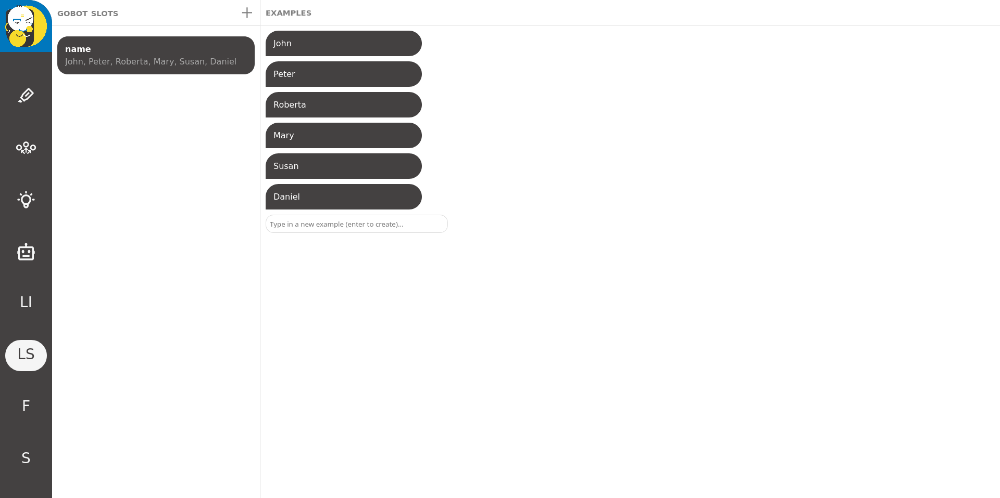
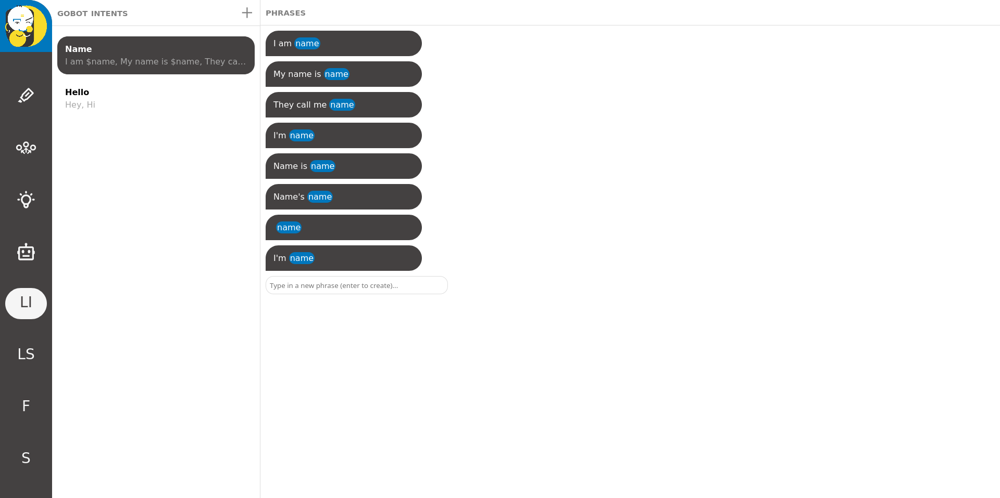
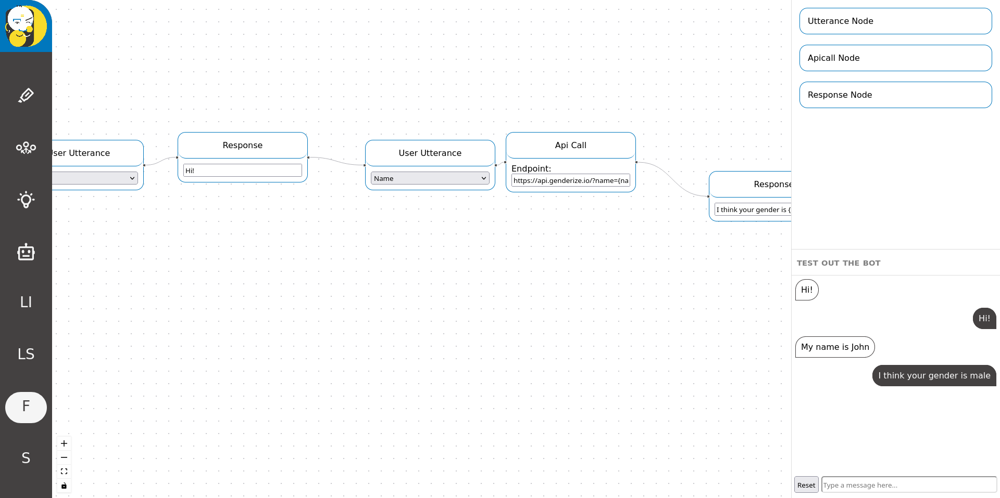
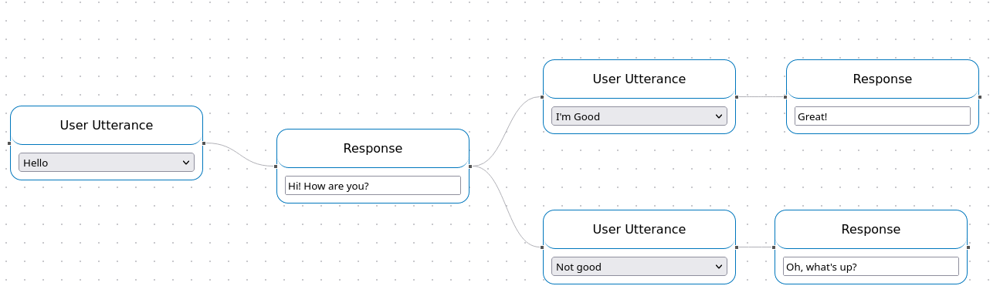

# DP-Builder Closed Alpha - Guide for testers

DP-Builder is a graphical tool for creating multiskill AI assistants with 0 coding required! Currently, it supports editing the intent catcher and the rule-based gobot.

First of all, thank you for helping the development by giving DP-Builder a try. The goal of this closed alpha is to gather as much feedback from real users as possible, so please share any thoughts/ideas/issues you have while using the software. 

## Setup

Right now, you need to build DP-Builder yourself to try it out. I am working on a more user-friendly method, but for now this is the only working way.

DP-Builder has been only tested on Linux, but it should work fine on MacOS. If you're under windows, please try building in [WSL](https://docs.microsoft.com/en-us/windows/wsl/install). You'll also need to use the terminal a little bit, but it's just a few commands.

First, make sure you have the following requirements set up on your system:
-   Node 16+
-   Python 3.8+
-   [pnpm](https://pnpm.io)
-   [poetry](https://python-poetry.org/)
-   [Docker](https://docs.docker.com/engine/install/)

Optional, but recommended for training:
-   Nvidia GPU
-   [Nvidia docker runtime](https://docs.nvidia.com/datacenter/cloud-native/container-toolkit/install-guide.html#docker)

Once you have those in place, clone the repository:

```
git clone https://github.com/deepmipt/dp-builder.git
cd dp-builder
```

Then install the dependencies:

```
pnpm install
```

### Component templates

DP-Builder is designed to edit existing deeppavlov-based components (annotators, skills, etc.). It does not yet have the capability to create one from scratch, so in order to use it you'll need to provide some basic component templates for all the skills/annotators you'd like work with. You can bring your own templates, or [use mine](https://github.com/deepmipt/dp-builder/releases/download/v0.1-alpha/components.zip). If you decide to use your own, here's how your project folder should look:

- 📂 __components__
   - 📂 __annotators__
     - 📂 __intent__
       - 📄 `Dockerfile` - instructions for building and running this component. The last CMD should define how to start the component as a server
       - 📄 `config.json` - the dp pipeline - [example](https://github.com/deepmipt/DeepPavlov/blob/master/deeppavlov/configs/intent_catcher/intent_catcher.json). Optional, if `train.sh` is provided
       - 📄 `train.sh` / `train.py` - The script that trains the component. Optional config.json is provided. (Then just `python -m deeppavlov train ./config.json` would be the default train command)
   - 📂 __skills__
     - 📂 __gobot__
       - 📂 __data__ - Optional. Can contain training data to be imported (`stories.md`, `nlu.md`, `domain.yml`)
       - 📄 `Dockerfile` - instructions for building and running this component. The last CMD should define how to start the component as a server
       - 📄 `config.json` - the dp pipeline - [example](https://github.com/deepmipt/DeepPavlov/blob/master/deeppavlov/configs/intent_catcher/intent_catcher.json). Optional, if `train.sh` is provided
       - 📄 `train.sh` / `train.py` - The script that trains the component. Optional config.json is provided. (Then just `python -m deeppavlov train ./config.json` would be the default train command)
       - 📄 `intents_config.json`
       - 📄 `slotfill_config.json`

Make sure that the root folder of your components is a git repository and that __all file are committed when you start a new training__. This is important, because when starting a new training, DB-Builder saves the latest commit from your project repository, so that later on you can see exactly what code you ran this particular training with. If your training fails right away, first check if you have any uncommitted changes in your project.

Put this folder, or unzip my templates, right next to the cloned `dp-builder` folder and it should be found automatically.

*Note*: right now there's an issue with importing existing training data from intent catchers, so it's disabled. I'll fix this as soon as I can. Importing stories, intents and slots from gobot should work fine.

### Running

Next, you have two options for running the program, depending on whether you're familiar with [tmux](https://github.com/tmux/tmux/wiki) or not:

#### Without tmux

You'll need to open two separate terminal windows (or tabs if your terminal app supports them), and in both navigate to the repository folder you cloned earlier.

In the first window:

```
cd packages/api_server
pnpm run dev
```

This will start up the backend server. Then in the second window enter:

```
cd packages/frontend
WEB_PORT=8080 API_PORT=8000 pnpm start
```

This should automatically open DP-Builder in your browser. If it doesn't, try navigating to [http://localhost:8080/](http://localhost:8080/).

#### With tmux

If you have tmux installed, and you're not terrified of it like most people, you can just use the development script like so:

```
./dev.sh
```

This should automatically open DP-Builder in your browser. If it doesn't, try navigating to [http://localhost:8080/](http://localhost:8080/).

## Usage

Once you see the interface in your browser, you can start editing your imported skills. 

### Intent catcher

Select the second icon from the top in the sidebar and the intent editor should appear:



__Creating intents:__
- You can create new intents by clicking the plus button at the top of the column on the left.
- Select a unique name for your intent
- You can delete an intent by right clicking it and selecting "Delete"

__Editing intents:__
 - On the right, you can add example phrases to your intent, by typing them into the text field and pressing enter to add.
 - You can edit already added phrases by double clicking on them
 - You can delete phrases by right clicking and selecting "Delete"
 
 __Training:__
  - Click the "Train" button in the bottom panel
  - Training can take up 5-10 minutes, depending on whether you have a GPU or not.
  - If the training crashes, it is most likely due to lack of memory. These models can consume several gigabytes of RAM, so it's best to close any other application and stop any other model you might have running.
  - Once the training finishes successfully, you should see a prompt in the bottom panel.
  - You can type any user message in the prompt and, after a small delay, the name of the predicted intent should show up under the box.
  - After the training, the first prompt you enter will load for quite a while, up to 2 minutes. This is because the model has to be initialized again from scratch. Subsequent prompts will be much faster.
  - *Please note*, that the training are versioned using a hash of the input data. This means that if you change any data (create/edit intents) a new training will be created (but won't be started automatically). The old training is not lost, it is still saved in the database, but currently there's no UI to access previous trainings. If you have any suggestions on how this interface should work, please let me know.

### Gobot

Open the sidebar, select Architecture > Skills > Gobot. Then you can choose from three editors, which are part of the gobot skill:



- Slot editor
- Intent editor
- Flow editor
- Settings - only placeholder for now

#### Slot editor



Using the slot editor is quite similar to the global intent editor:
- Create slots on the left, and give them unique names. (Lowercase, single word names recommended)
- Defined example slot values on the right
- You can edit slot names or examples by double clicking them
- You can delete slots or examples by right clicking and selecting "Delete"

#### Intent editor



The usage of the intent editor is identical to the intent catcher editor, with one difference: you can insert slots into your intent examples. To reference a slot use `$` + the name of the slot. For examples: `My name is $name`; `I'd like some $food`. Make sure you create the corresponding slots first in the slot editor.

#### Flow editor



This is where you define the general structure of the dialogue. If you're familiar with the RASA config format, the previous two windows correspond to the `nlu` file. The flow editor creates the `stories` file, but it might not be immediately obvious how.

The flow editor lets you create a graph. Individual nodes either represent a user utterance, or a response to an utterance. If two nodes are connected, that means that they follow each other in the stories. Nodes can have branches, meaning that the output of one node can connect to the inputs of multiple nodes. This would generate multiple stories, one for each possible path on the graph. Loops (a node connecting to an earlier node) are not allowed. As an example the following simple graph:



would generate the following stories:

```
# story1
* hello
 - system_hey
* im_good
 - system_great

# story2
* hello
 - system_hey
* not_good
 - system_whatsup
```

__Node types:__
 - User utterance - means that in this place in the flow we are expecting a specific user intent. You can select the intent in the dropdown inside the node. Only intents created in the gobot's intent editor can be chosen, the ones created in the intent catcher editor are not. This must be the first node in all flows.
 - Response - a system response to a user utterance. Must follow a user utterance or an API call. You can type in the response in the text field inside the node. You can insert variables from the previous API call into a response using the bracket notation: `Hey there {name}`
 - API call node - makes an HTTP call to an external endpoint and stores the result (only JSON supported), so that it can be used in the next response to the user. You can insert slot values from the previous utterance using bracket notation: `https://example.com/data?name={name}`

__Creating nodes:__
 - Simply drag and drop the desired node from the palette on the left to the canvas on the right.
 
 __Connecting nodes:__
  - Click on the output connecting point of the first node and drag it over the input connecting point of the second node. Make sure your cursor turns into a cross before you drop, because only then you're dropping to the right place.

__Deleting nodes:__
 - Use the right-click context menu and select "Delete".
 
 __Training:__
  - Click the "Train" button in the left testing panel.
  -  Training a gobot can take quite a while, depending on your computer. On a GTX1080 Ti, it should be around 15-20 minutes. Generally, it will take almost 2x as long as training the intent catcher (since the gobot itself also has a built-in intent catcher). So feel free to grab some coffee while your bot is training.
  - Once the training is done, a small chat window should appear in the testing panel.
  - You can type in a user message and hit enter to send.
  - After a small delay (the first initialization can take 2-3 minutes, subsequent responses are much faster) you should see the bot's response. You can continue the dialogue, by typing in another message and sending it.
  - You can reset the bot, by clicking the "Reset" button next to the input field. This will take 2-3 minutes again and then the bot should forget all previous messages.
  - *Please note*, that the training are versioned using a hash of the input data. This means that if you change any data (create/edit intents, change the flow etc.) a new training will be created (but won't be started automatically). The old training is not lost, it is still saved in the database, but currently there's no UI to access previous trainings. If you have any suggestions on how this interface should work, please let me know.

## Reporting issues, providing feedback

Please share any thoughts/issues/ideas that you have while trying DP-Builder out, so that we can make it the best tool for creating AI assistants! Please post everything in the alpha testers slack channel, so that we can discuss it, then once we have enough details about the suggestion/bug, I'll make an issue on the github repository.

If you encounter bugs, please
1. Describe what you were doing when things went wrong
2. If you used your own component templates, please share them
3. Attach the file `packages/api_server/test.db` from the dp-builder folder
4. Attach logs from the browser console (Right click -> Inspect -> Console tab in the newly opened dev tools)
5. Attach the output from the terminal. (If you are using two windows, I'm mostly interested in the api_server's output. If you're using tmux, just send a screenshot, even I don't know how to copy stuff from there)

Thank you for taking the time to help with DP-Builder's development. Looking forward to hearing your thoughts about my project :)

